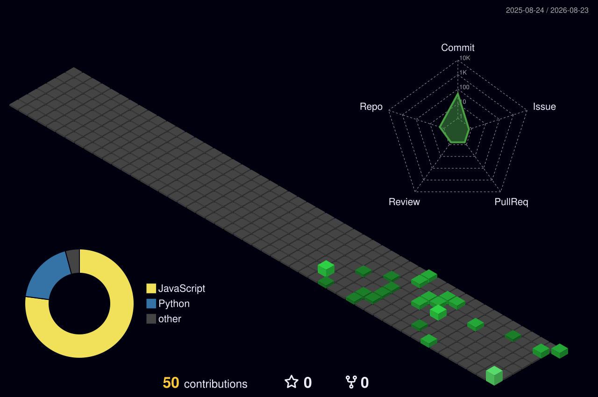

<!-- ═══════════════════════════════════════════════════════════════ -->
<!--                    PRAGYAN VERMA                              -->
<!--              GitHub Profile README                            -->
<!-- ═══════════════════════════════════════════════════════════════ -->

<div align="center">

# 👋 Hi, I'm **Pragyan Verma**

### AI & Data Science • Full-Stack Engineering • DevOps • ML Systems

**Building production-oriented software and intelligent systems.**

### `Full Stack → DevOps → MLOps → AI Systems Architecture`

<br/>


</div>

---

## 👨‍💻 About Me

I'm a **B.Tech undergraduate in Artificial Intelligence & Data Science** interested in building systems that connect software engineering, machine learning, infrastructure, and AI.

Currently, I'm working as an **Engineering Intern at Housify Realty**, where I'm gaining hands-on experience building and maintaining a real-world SaaS product and working across the full-stack and DevOps side of the system.

My engineering journey is focused on progressively moving from:

```text
Software Engineering
        ↓
Full-Stack Development
        ↓
DevOps & Cloud
        ↓
Machine Learning Engineering
        ↓
MLOps
        ↓
AI Systems Architecture
```
---

## 🔗 Connect With Me

<div align="center">

<a href="https://www.linkedin.com/in/pragyan-verma-674258230/" target="_blank">
  
</a>
&nbsp;
<a href="https://mail.google.com/mail/?view=cm&fs=1&to=pragyanverma.9871@gmail.com" target="_blank">
  
</a>

</div>


## 🏢 Experience

### Housify Realty — Engineering Intern

I'm currently working as an **Engineering Intern at Housify Realty**, contributing to a real-world SaaS platform and gaining hands-on experience in production-oriented software engineering.

My work spans:

- 💻 Full-Stack Application Development
- 🔌 Backend & API Engineering
- 🗄️ Database-Driven Systems
- 🔐 Authentication & Authorization
- 🏗️ Production Application Architecture
- ⚙️ DevOps & Deployment
- 🔄 Git & GitHub Workflows
- 📱 Responsive & Scalable Application Design

This experience is helping me bridge the gap between **building applications** and **engineering production systems**.

> **From writing features to understanding how complete systems are built, deployed, maintained, and scaled.**
---

## 🚀 Featured Projects

### 🏠 Housify Realty

**Production-oriented real-estate SaaS platform**

An end-to-end real-world SaaS application where I've gained hands-on experience working across full-stack development, backend systems, application architecture, moderation workflows, deployment, and DevOps practices.

**Focus Areas**

- Full-Stack Engineering
- Backend & API Development
- Database Systems
- Authentication & Authorization
- Property & Image Moderation
- Production Architecture
- DevOps & Deployment

🔗 **Live Platform:** https://housifyrealty.com/

### 🎬 Movie Recommender System

**Content-based movie recommendation system built with Python and Streamlit**

A machine-learning application that recommends similar movies using content-based similarity and integrates the TMDB API to retrieve movie information and posters.

**Focus Areas**

- Python
- Machine Learning
- Recommendation Systems
- Similarity-Based Modeling
- API Integration
- Streamlit
- Cloud Deployment

🔗 **Live Demo:** https://movie-recommender-system39.streamlit.app/

---

## ⚙️ Technology Stack

### 💻 Languages

<div align="center">


</div>

### 🌐 Full-Stack Development

<div align="center">


</div>

### 🔌 Backend & APIs

<div align="center">


</div>

<p align="center">


</p>

### 🤖 Machine Learning & AI

<div align="center">


</div>

<p align="center">


</p>

### ⚙️ DevOps & Deployment

<div align="center">


</div>

<p align="center">


</p>

### 🛠️ Tools & Development Environment

<div align="center">


</div>

<p align="center">


</p>

### 🌱 Currently Exploring

<div align="center">


</div>

<p align="center">


</p>

---

## 📊 GitHub Analytics

<div align="center">


</div>
---

## 🔥 Contribution Streak

<div align="center">


</div>

---

## 📈 Contribution Activity

<div align="center">


</div>

---

## 🧊 3D Contribution Activity

<div align="center">



</div>
